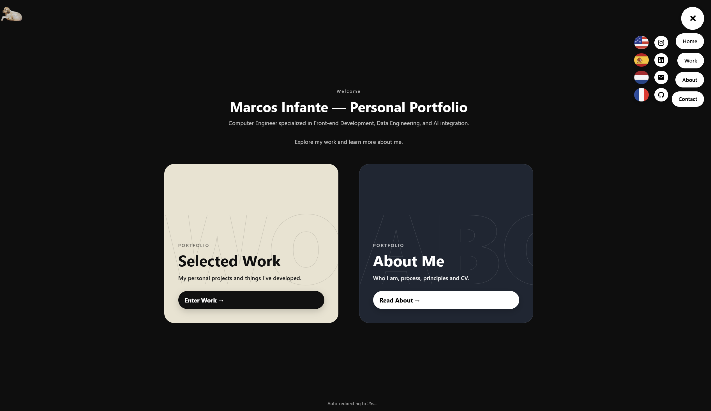

# 🌐 CVWeb — Personal Portfolio Website



A cinematic, multilingual, and responsive personal portfolio built with **React**, **TypeScript**, **Framer Motion**, and **Vite**.  
This project serves as my **interactive online CV**, showcasing my work, technical background, and personal projects in a fluid and visually engaging experience.

---

## ✨ Features

- 🎬 **Smooth Animations & Transitions** — powered by *Framer Motion* for a cinematic experience  
- 🌍 **Multilingual Support (EN / ES / FR / NL)** using *i18next*  
- ⚡ **Modern Tech Stack** — React + TypeScript + Vite  
- 🧩 **Modular Architecture** — structured for scalability and reusability  
- 🧠 **Dynamic Project Pages** — generated from JSON data  
- 📱 **Responsive Layout** — optimized for all devices  
- 🧭 **Accessible UI** — keyboard and screen reader friendly  

---

## 🧱 Project Structure

```bash


CVWeb/
├── public/                  # Static assets and images
│   ├── images/              # Portfolio visuals
│   ├── animations/          # Motion assets
│   └── Marcos_Infante_Curriculum.pdf
├── src/
│   ├── assets/              # Global icons, fonts, misc
│   ├── components/          # Reusable UI components (FabMenu, SocialBubbles, etc.)
│   ├── data/
│   │   └── projects/        # JSON-based project data
│   ├── hooks/               # Custom React hooks (scroll, inertia, etc.)
│   ├── i18n/                # Internationalization setup (EN, ES, FR, NL)
│   ├── pages/               # Page components (Home, Work, About, Contact)
│   ├── utils/               # Shared helpers and styles
│   ├── App.tsx              # Root application
│   └── main.tsx             # React entry point
├── package.json
└── vite.config.ts
```
## 🚀 Getting Started

### 1️⃣ Clone this repository
```
git clone https://github.com/mainfavin/CVWeb.git  
cd CVWeb  
```
### 2️⃣ Install dependencies  
```
npm install  
```
### 3️⃣ Run locally  
```
npm run dev  
```
Your development server will start at **http://localhost:5173/**.

---

## 🧩 Technologies Used

| Category | Stack |
|-----------|--------|
| Framework | React 18 + TypeScript |
| Bundler | Vite |
| Animation | Framer Motion |
| Localization | i18next |
| Styling | CSS Modules + Inline Styles |
| Version Control | Git + GitHub |

---

## 🧠 Architecture Overview

The app uses a **component-based architecture** with **data-driven rendering**.

- Each project (AI ETL, CLI Tools, etc.) is defined as an object in `/src/data/projects/`.
- Pages like `/work` and `/project/:slug` dynamically read from that data source.
- All text content is localized through `/src/i18n/[lang]/*.json`.
- Global elements like navigation, FabMenu, and language switcher are shared across routes.

---

## 📸 Preview

*(Insert screenshots here, e.g. Home page, Work page, etc.)*

---

## 📄 License

This project is open source under the **MIT License**.

---

## 🤝 Contact

**Marcos Infante Viñuela**  
📍 Based in the Netherlands  
📧 [marcos.infante.vinuela@gmail.com](mailto:marcos.infante.vinuela@gmail.com)  
🌐 [marcosinfante.dev](https://marcosinfante.dev) *(optional — if you deploy it)*  

> _“Design meets logic — building expressive and intelligent digital experiences.”_
